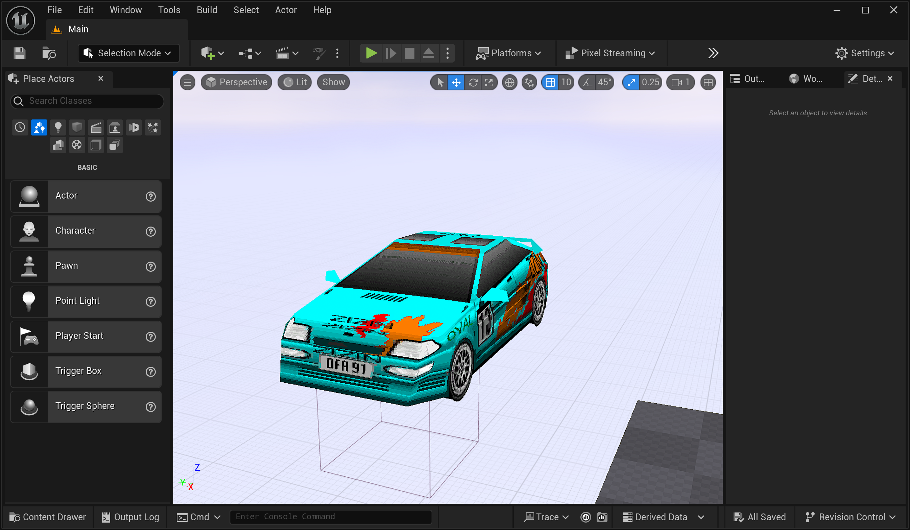

# Roller Track Editor
Whiplash/Fatal Racing track editor, OBJ resource converter, and library for loading Whiplash assets. FBX export is an optional developer feature.

## Build

Clone recursively so the pinned ROLLER editor core is available:

```sh
git clone --recursive https://github.com/FatalDecomp/TrackEditor.git
cd TrackEditor
cmake -S . -B out/build -DTRACKEDITOR_ENABLE_FBX=OFF
cmake --build out/build --config Release
```

The CMake build uses dynamic Qt 5.15 and system/prebuilt SDL3 and SDL3_image packages. It builds ROLLER's `ROLLER::core` target with the game disabled, so WildMidi and libcdio are not required. See [docs/building.md](docs/building.md) for Windows, Linux, macOS, run, and optional FBX instructions.

## Track Editor Features: 
* Open, render, edit, and save Whiplash tracks
* Multiple tracks open at once in tabs
* Export tracks to OBJ format
* Optionally export tracks to FBX format when built with a local Autodesk FBX SDK
* Track geometry data can be edited and track chunks can be added and removed
* Additional surface data such as grip level and AI data can be edited
* Surface textures can be changed
* Signs can be added, removed, repositioned, and edited
* Audio triggers can be added, removed, and edited
* Moving stunts can be added, removed, and edited
* Track global settings such as texture files and lap data can be edited
* Surface backface textures can be changed
* Undo/Redo and Cut/Copy/Paste between tracks
* Fine control over Copy/Paste behavior
* Toggle display of each individual section of track


## ModelExporter Features:
* Included with Track Editor releases
* Exports all Whiplash tracks and cars to OBJ or FBX format




## External dependencies used:
* Dynamic Qt 5.15
* SDL 3.2.22 or newer
* SDL_image 3.2.4 or newer
* GLM 1.0.1: https://github.com/g-truc/glm
* stb_image 2.30: https://github.com/nothings/stb
* stb_image_write 1.16: https://github.com/nothings/stb
* Optional FBX SDK 2020.3.7 or compatible, installed outside the repository
